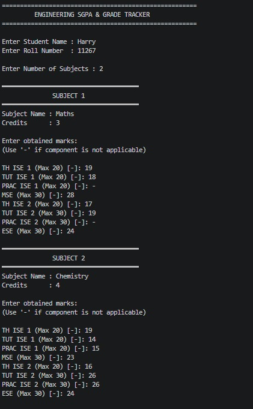
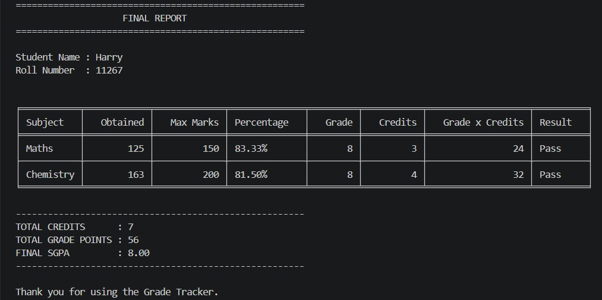

# Engineering SGPA & Grade Tracker

A Python-based terminal application developed to calculate grades and SGPA according to the engineering credit and grading system.

## Features
- Subject-wise marks entry
- Grade calculation based on percentage
- Credit-based SGPA calculation
- Input validation for marks
- Support for non-applicable evaluations using "-"
- Formatted tabular report generation

## Evaluation Components
- TH ISE 1
- TUT ISE 1
- PRAC ISE 1
- MSE
- TH ISE 2
- TUT ISE 2
- PRAC ISE 2
- ESE

## Technologies Used
- Python
- Tabulate Library

## Grading System

| Percentage | Grade |
|------------|-------|
| 90% and above | 10 |
| 85% and above | 9 |
| 70% and above | 8 |
| 60% and above | 7 |
| 50% and above | 6 |
| 45% and above | 5 |
| 40% and above | 4 |
| Below 40% | Fail |

## How to Run

```bash
pip install tabulate
python grade_tracker.py
```
## Sample Output

### Output Example 1


### Output Example 2


## Author
Harry Fernando
